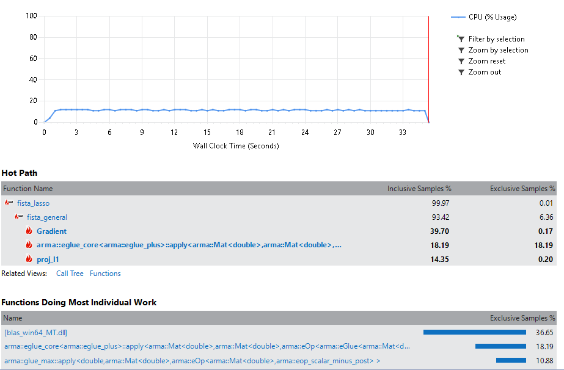

# FISTA
This repository contains a C++ code implementation of the Fast Iterative Shrinkage/Thresholding Algorithm using the [Armadillo](http://arma.sourceforge.net/) library.

## Tooling
- Windows 10
- Microsoft Visual Studio Community 2017
- Matlab R2017a
- mex setup to compile with Microsoft Visual Studio Community 2017, patch available in directory matlab_patch/

## Building/Running the code
1. build the Microsoft Visual Studio solution Fista.sln
1. (optionnal) run executable generated by mve.vcxproj to check that all basic C++ tests are passing 
1. build the Matlab mex files with matlab/build_mex_files.m
1. check correctness of the C++ implementation against Matlab by running matlab/test_mex_files.m

## Considerations
- The software builds for Windows, with Microsoft Visual Studio Community 2017 as a build platform, assuming that Windows being the platform of choice at midx
- library developed in C++
- This is a **time constrained** development exercise
- as the FISTA algorithm operates on Matrixes, I used [Armadillo](http://arma.sourceforge.net/) as a library of choice for all matrix operations in C++
- [Armadillo](http://arma.sourceforge.net/) needs the [LAPACK and the BLAS libraries](http://www.netlib.org/lapack/lug/node11.html). 

## Directory content
- externals: artifacts needed to build my solution (Armadillo, Lapack and Blas)
- matlab: matlab test code to check C++ bit exactness against Matlab code
- matlab_fista: matlab fista lasso reference algorithm 
- matlab_patch: MathWorks patch to build mex files with Visual Studio 2017 and Matlab 2017a
- solutions: microsoft visual studio solution and 2 project files:
    1. fista_lib.vcxproj to build the algorithm  (\*.lib)
    1. fista_test.vcxproj to build a simple algo test app (\*.exe)
- src: the C++ Fista algorithm code
- README.md: this readme

## Code considerations
As this is a direct implementation of some Matlab code, and a time constrained exercise, I kept a lot of things from Matlab
- all variables names are kept
- overall algo structure and function names are kept
- most of the comments in C++ contains the Matlab code. As such, the C++ code below a comment is the C++ implementation of the commented Matlab code
- the Matlab code is not object oriented, neither is mine. This point **should be addressed in a refactoring effort**
- the Matlab code uses function handle to pass functions to the algorithm (gradient, project and cost). In my implementation, those functions are hardcoded (they are in the same file). Function pointers should be used, or may be a more elaborate construct could be used in a refactoring effort.

## Testing
I built a C++ implementation mimicking the Matlab code. The C++ code was built progressively doing one function at a time using the test_all() function in the fista test application.
- test_CalcXtY();
- test_Gradient();
- test_proj_l1();
- test_norm1();
- test_lasso();

The code builds and runs, but bit-exactness needs to be verified. If something is not tested properly, it probably does not work. Testing my algorithm against the Matlab reference still needs to be completed.  

## Testing against the Matlab reference

### SPAMS toolbox
There is everything in place in the original FISTA repository: https://github.com/tiepvupsu/FISTA under the spams/test_release directory.  
  
The development strategy for the spams toolbox is a divide and conquer approach. For each FISTA algorithm elementary function to implement in C++, a matlab test implements the function in Matlab, and compare the result against the C++ implementation called via a mex file. See for instance test_CalcXtY.m under spams\test_release in https://github.com/tiepvupsu/FISTA

As more and more low level functions are tested, intermediate and more complex functions can be assembled, and tested against Matlab code. As lower level functions are sure to be bit-exact, it gives confidence when assembling them into more complex functions, and only the glue code remains to be debugged.

Debugging in this setup becomes easy as it is possible to step inside the mex code and see what is going on with the Visual Studio debugger. (MSVC > Debug > Attach to process -> choose Matlab process). To do this, the code needs to be built in debug mode, mex files and the fista library.

### Adopted approach 
I adopted a similar approach in the matlab directory. I have mex files that I can build and test against matlab reference output. Each mex file calls a simple function from the Fista library, and there is a corresponding test to exercise the function in test_mex_files.m.
- build_mex_files.m: building all mex files
- test_mex_files.m: testing the fista lib through mex files
- test_Lasso.m: testing the global lasso algorithm

### Status
To be sure that my implementation is bit exact, all functions below should be bit exact. The checked functions below are verified to be bit-exact.
- [x] CalcXtY();  *tested in test_mex_files.m*
- [x] Gradient();  *tested in test_mex_files.m*
- [x] proj_l1();  *tested in test_mex_files.m*
- [x] norm1();  *tested in test_mex_files.m*
- [x] fista_lasso();  **tested in test_Lasso.m**

## What to do next/still to be done
- testing could be improved. For instance proj_l1 has two parameters, but I test with a fixed value for lambda. I could make random permutations for lambda in order to make sure that the function works for any pair of input arguments. I could improve testing for much more functions
- investigate why the mex files needs blas_win64_MT.dll and lapack_win64_MT.dll to run properly
- there is a warning when building the C++ code (minor: overlapping directory for output compilation)
- improve design in order to pass cost functions, gradient and projections as functions pointers for the fista algorithm
- better comment. C++ code contains only matlab code as for comment. functions and functions headers should properly be documented, in C/C++ fashion
- improve porting. Not all code path are implemented in C++. For instance, proj_l1 behaves differently whether the pos parameter is true or not. I only coded the true case, as demo_lasso.m, demo_full.m and test_Lasso.m set the pos parameter to true.

# Rework after review comments - 3/9/2018

## Changes since last delivery
- all functions have a single Matlab test file, to compare against its matlab implementation, please see matlab\test_mex_files.m
- completed C++ proj_l1() function, passing lambda and pos parameter
- C++ code optimized, under OPTIMIZE compiler define
- profiling against Matlab version done

### Bit exactness
test_lasso.m exercises the lasso algorithm over 1000 random permutations,
parameters lambda, pos, matrix sizes are picked randomly at each permutation.

Whatever are the input parameters, C++ and Matlab solutions are so similar that when subtracting the two solutions, taking the square and summing all elements, it is never larger than 1.0e-20. 

Other C++ functions are tested in the same way for bit exactness.

### Unit testing
I added a unit testing project in the solution, please see FISTA\solutions\unit_testing.  
There are 2 tests for the proj_l1 function:
1. normal test case
1. test case with lambda not comprised between 0 and 1. We make sure the code throws an exception for out of range parameters.  

Still to do/fix:  
- Other tests for other functions and parameters need to be added.
- Exception should be under DEBUG compiler define.
- unit testing does not work for all configurations, to be looked into !

## Optimizing the code and profiling against Matlab

### Optimization
The compiler switch OPTIMIZE has been added in the code and 2 new configurations have been added to the solution:
- DebugOpt: similar to debug, but with OPTIMIZE flag provided
- ReleaseOpt: similar to release, but with OPTIMIZE flag provided

The following optimizations have been made in the C++ code:
- functions return their output using a reference as an output parameter
- division by x_new.n_elem does not have to be done at each iteration and can be incorporated in the tolerance comparison.
-  t_new = 0.5*(1 + sqrt(1 + 4 * pow(t_old, 2))) has been changed into  
t_new = 0.5 + sqrt(0.25 +  pow(t_old, 2));

### Profiling against Matlab
Profiling C++ code against Matlab is done with different input. Respective input are random, but have similar sized matrices.

### Matlab 
#### profiling the lasso algorithm
In profile_lasso.m, call fista_lasso() 10000 times with same parameters. 
It takes 89.11 seconds.

### profiling initial C++ code
In test_fista.cpp, the test_lasso() function does the same thing as profile_lasso.m.

Steps to reproduce:
1. Open the solution
1. Builds fista_test in Release configuration
1. Builds fista_test in ReleaseOpt configuration
1. Go to FISTA\solutions\x64\Release
1. execute in a shell fista_test.exe
    - initial version: 32.86 seconds (2.71 faster than Matlab)
1. Go to FISTA\solutions\x64\ReleaseOpt
1. execute in a shell fista_test.exe
    - optimized version (under OPTIMIZE switch): 29.90 seconds (2.98 times faster than Matlab, roughly 10% faster than the non optimized version)

### Profiling the code with a profiler
Visual Studio code has a built-in profiler: Menu Debug > Performance Profiler 
When profiling the Debug Opt configuration, and sorting functions by self-time, 
I got the following results:  

There is not so much I can do for gradient() and proj(), they are optimized. There is also a lot time spent inside the blas dll.

### Results

C++ code performance is ok, around 3 times faster than Matlab. This is acceptable, but may be not as fast as expected.

### Going further

#### Matlab
Despite being an interpreted language, Matlab is not ridiculously slow. It is heavily optimized, all matrix operations being done with the AVX2 instruction set: https://nl.mathworks.com/support/sysreq.html

#### Armadillo
Armadillo uses Lapack, and the Lapack implementation provided with Armadillo might not be as optimized as necessary. From the Armadillo authors:
> The folder "examples/lib_win64" contains reference LAPACK and BLAS libraries > compiled for 64 bit Windows. The compilation was done by a third party. USE AT YOUR OWN RISK. The compiled versions of LAPACK and BLAS were obtained from:
> http://ylzhao.blogspot.com.au/2013/10/blas-lapack-precompiled-binaries-for.html

[Intel MKL](https://software.intel.com/en-us/mkl) contains a LAPACK library, seems heavily optimized and could be used as a one to one replacement to check if performance is not better.

Armadillo can also be linked against [NVBLAS](http://docs.nvidia.com/cuda/nvblas/), a GPU-accelerated implementation of BLAS.

#### Other software
I made the choice of using Armadillo to favor ease of porting to C++. Because Armadillo authors use function names similar to Matlab, the porting was easy and straightforward. Other libraries might provide better performances at the cost of a higher porting effort. This is a tradeoff.

Last resort should be to write manually GPU code. This is probably something we want to try at the last moment, only for critical pieces of code. 

